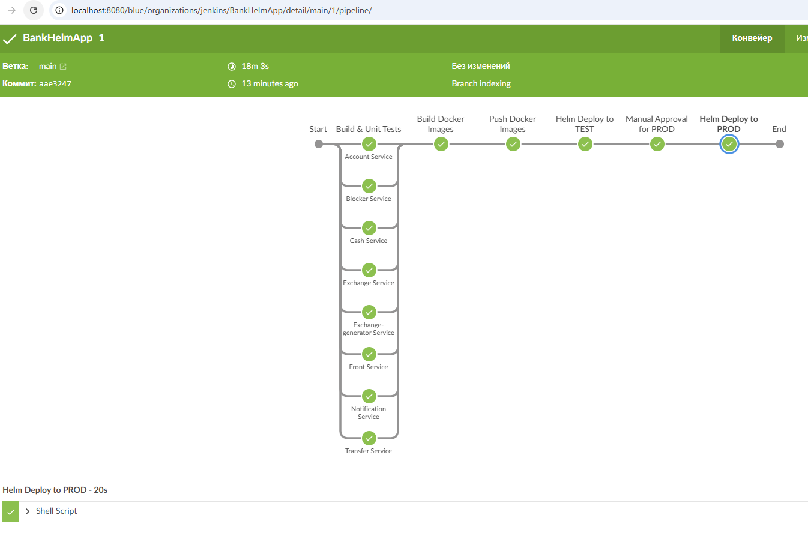

# Bank Application
Микросервисное приложение «Банк»:
- фронт (front-service);
- сервис аккаунтов (account-service);
- сервис обналичивания денег (cash-service);
- сервис перевода денег между счетами одного или двух аккаунтов (transfer-service);
- сервис конвертации валют (exchange-service);
- сервис генерации курсов валют (exchange-generator-service);
- сервис блокировки подозрительных операций (blocker-service);
- сервис уведомлений (notification-service)

Используемые технологии:
- Spring Boot Framework
- Spring Web MVC
- Spring Data JPA
- Thymeleaf
- Lombok
- PostgreSQL
- Keycloak
- Kafka
- Prometheus
- Grafana
- ELK stack

Предварительная настройка:
- minikube start
- minikube tunnel
- заполнить файл jenkins/.env, указав конфиг для подключения к minikube, токены для подключения к github

Запуск Jenkins приложения:
```
cd jenkins
docker compose up
```

- После запуска Jenkins доступен по адресу: http://localhost:8080
- Jenkins после запуска имеет pipeline настроенный на github репозиторий, производит сборку проекта, 
сборку docker образов, публикацию docker образов в registry и развёртывание проекта в локальном minikube.
- После деплоя в minikube, проект доступен по адресу: http://bankapp-test.local и http://bankapp-prod.local, которые необходимо добавить в файл hosts

